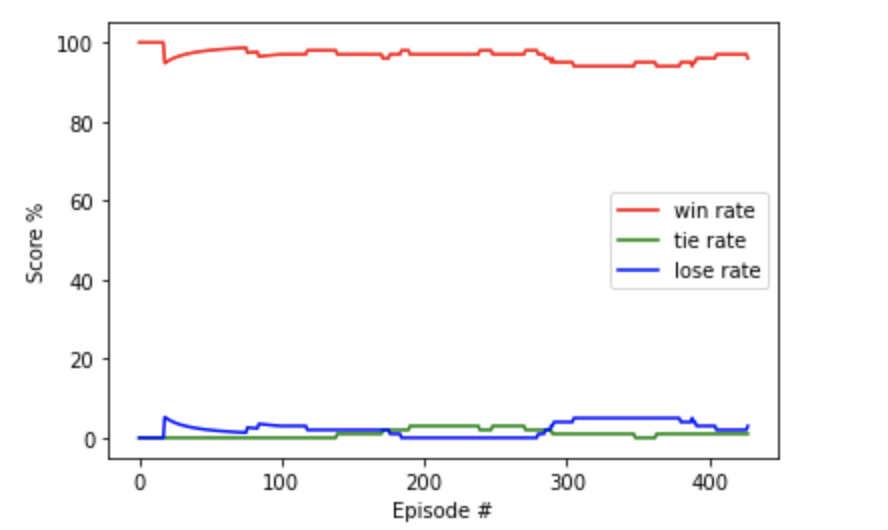

<iframe width="640" height="360" src="https://www.youtube.com/embed/kTcRRaXV-fg?ecver=1"  
 frameborder="0" allow="autoplay; encrypted-media" allowfullscreen></iframe>

# 1주차
- 환경설정 방법
    - 환경설정은 PySC2 StarCraft II Learning Environment Setup.md 을 참고바랍니다.

# 2주차
# [구현내용 설명]

[Github URL]
- https://github.com/kmh03214/dmarl-sc2

[구현 내용 설명]
- 베이스라인 코드에 구현 되어있는 Terran 베이스라인 코드의 건물 build 순서를 조정
    Refinery 건설 -> supply건설 -> barrack건설 ->
    Marine 생산 -> Factory건설 -> Hellion 유닛 생산 -> 인구수 30 이상시 공격하는 코드를 구현

Q1. 놀고있는 SCV를 찾고 싶었는데, IDLE 함수가 actions.FUNCTIONS.select_idle_worker 에 있는 것 같은데,
해당 함수를 이용 할 줄 몰라서 구현이 어려웠습니다.

Q2. Refinery를 건설 후 Gas를 채집하는데, SCV를 1마리 이상을 넣고 싶은데, 잘 구현이 안되었습니다.

Q3. async 함수 및 await를 사용하여 비동기구현을 할 수는 없는건가요?

# 3주차
# [구현 내용 설명]

- 베이스라인 코드에 구현 되어있는 Terran 베이스라인 코드에 건물이 지어질 위치 랜덤하게 변경 (건물이 여러개 지어 질 수 있도록)
- epsilon 값 reward 값

- state space
    - state에 refinery_count 값 추가하여 2개이하로 컨트롤

- action space
    - refinery, Factory ,Starport, Armory 건설 코드 추가
    - Marine, Archor 및 Viking 생산 코드 추가
    - 공격 포지션 16곳에서 4곳으로 축소 코드 수정

Q1. 시점을 이동하면서 건물이 지어질 위치를 조절해보고 싶은데 방법을 잘 모르겠습니다...(예를들어 다른 위치에 건물을 건설하여 자원을 캐는 행위)

Q2. 건물을 짓고나서 쉬고 있는 SCV를 다시... 자원을 캐도록 하고 싶은데 잘 안되네요...

Q3. 감사합니다!!

# 4주차
# [구현 내용 설명]

- 없음, 기존 Base codeline 실행

# Final Project
# [구현해야 할 것]

## 주의사항
---

actions 추가할때마다
모델 action space dim 1증가

---

1. Refinery 설치 및 Food_cap에 따른 Supplydepot 설치
    - base_top_left 일때 / 아닐때 (4 by 4) (OK)

2. CommandCenter 추가설치 하여 자원충당 (OK)
    - 만약 초기 커맨드센터가 파괴되었을시 다시 그 자리에 설치

3. Train_SCV (OK)
    - scv수 자원에 맞춰 생산 최적구현

4. 자원 채집 문제 (OK)
    - 최적 자원(gas, minerals) worker assigned

4. Build_Supply_randomly / Build_Barracks_randomly ( OK )
    - 서플라이 디팟 건설 조건 추가
    - 배럭 건설갯수 제한

5. Attack point 변경 (OK)
    - Random Attack point 증가
    - 상대방 Second multi Attack point 추가

6. Attack_ALL
    - Attack All 할 때 함수에, 생산유닛 추가될 때마다 추가 (OK)
    - 20이상일 때 공격

7. build_Factory(OK)
    - 건설위치 특정 지역에서 random 제한
    - train tank

8. build Starport (OK)
    - 건설위치 특정 지역에서 random 제한
    - train banshee
    - train Raven ( Detection 기능을 위한 생산)

9. Tank Control (OK)
    - Seige & UnSeiged 구현
    - 탱크 부분 컨트롤 구현 ( tank subset choice)

9. 업그레이드 추가 (Fail)
    - 해당 함수 사용이 안됨

9. Reward Function 정의

10. DQN 정의 (Action Space 추가)

# 코랩 
    - action 정의 함수에서 문제가 있음

# 추가구현 해야할 것
    - 본진 센터가 터졌을 경우 재건하기 (OK)
    - 업그레이드 문제 (Fail)

# Trouble Shooting
    - Colab 환경에서 실행 시, Socket connection timed out 에러가 발생함
    - 이 이슈는 action space를 정의할 때, raw_function.attack_pt( unit.tag, attack_point )에서,  
    unit이 다수(2개 이상)가 될 경우에 생김# Starcraft2_RL_Deepmind

    - 해결 방법 :  제공해 드린 Colab ‘Training StarCraft 2 Agent under Colab’ 에서 ‘Download StarCraft II’ 부분의 설치버전을 4.0.2 에서 최신 버전인 4.10 버전으로 바꾸어 줍니다.  

    <AS-IS>
    !wget http://blzdistsc2-a.akamaihd.net/Linux/SC2.4.0.2.zip
    !unzip -P iagreetotheeula -oq SC2.4.0.2.zip -d ~

    <TO-BE>
    !wget http://blzdistsc2-a.akamaihd.net/Linux/SC2.4.10.zip
    !unzip -P iagreetotheeula -oq SC2.4.10.zip -d ~

# Train Graph

게임 난이도 Hard 버젼 승률그래프  

 </img>
